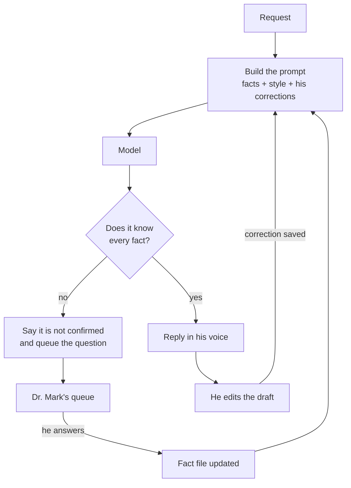

# Dr. Mark, text clone

A text assistant that writes as Dr. Mark, a dentist and implant educator, and
refuses to invent anything he has not confirmed.

Built for the JobWell Staffing AI Digital Clone Developer assignment.
Kindly access the live demo from the following link: https://mrwan-awad-ai-clone-dev.streamlit.app/

## The point

His course price, dates and venue are not decided yet. A clone that guesses
them is worse than no clone, because the mistake arrives in his voice and his
audience believes it.

So the unconfirmed facts live in one file as `null`, the model is told that
null means "not decided, never guess", and any question it cannot answer is
queued for Dr. Mark instead of being answered anyway.

## What it does

1. Writes a short course announcement.
2. Answers "How much does the course cost, and when is it?" without inventing
   a price or a date.
3. Revises the announcement to be conversational and under 80 words.

The third one is checked in Python rather than trusted to the model, because
models are unreliable at counting their own words.

## How it works



Two loops feed the prompt. Missing facts go to his queue and come back as
confirmed facts. His edits are saved as corrections and shape every later
draft, so the clone gets more like him without retraining.

The model has to answer in JSON:

```json
{"reply": "...", "missing_info": ["price", "dates"], "needs_human_input": true}
```

That makes "I need a human" a structured field rather than a phrase to parse
out of prose, which is what makes the escalation programmable.

## Where to find things

| | |
|---|---|
| [`demo_output.md`](demo_output.md) | Transcript of the three tasks, with the checks that passed |
| [`docs/strategy.md`](docs/strategy.md) | The full-clone strategy: voice, video, workflow, timeline, costs, privacy |
| [`docs/INSTALL.md`](docs/INSTALL.md) | How to install, run and deploy it |
| [`knowledge/profile.yaml`](knowledge/profile.yaml) | His facts. `null` means not decided. The escalation list is here too |
| [`prompts/system_prompt.md`](prompts/system_prompt.md) | The system prompt, including the never-guess rule |
| `data/` | The queue of questions waiting for him, and his saved corrections |

Content sits at the top level rather than inside `src/`, because those are the
files Dr. Mark or his assistant edit. Changing a price should never mean
opening a source folder.

## Platform versus my work

The platform provides one thing: the language model.

Everything that makes it Dr. Mark rather than a generic assistant is in this
repository. The profile as the single source of facts. The rule that null is
never guessed, and the escalation list covering prices, dates, clinical claims
and patient cases even when an answer looks available. The JSON contract. The
pending questions queue. The corrections loop. And the automated checks that
prove the refusal behaviour actually holds, rather than asserting it.

## Not built

Voice cloning, video avatar, long-term memory across conversations, and the
publishing integrations are covered in the strategy document, not implemented
here. The assignment asked for the text prototype to work; everything else is
a plan.
